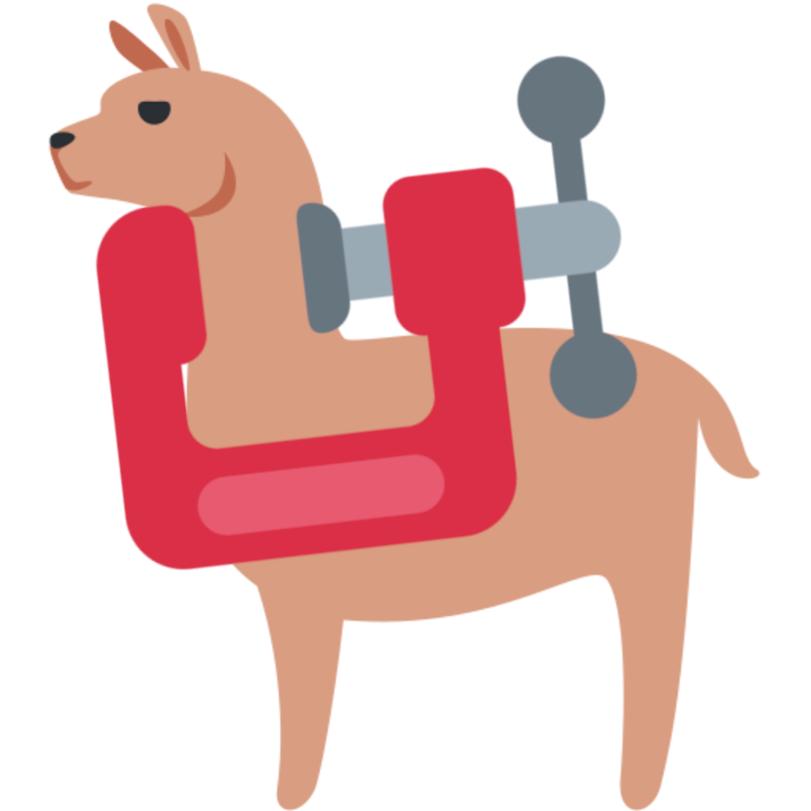

<!-- PROJECT LOGO -->
<br />
<div align="center">
  <a href="https://github.com/Wheest/signal-llm-compress">
    
  </a>

  <h3 align="center">Signal LLM Compress</h3>

  <p align="center">
    Get an LLM summary of your Signal messages
    <br />
  </p>
</div>

<!-- ABOUT THE PROJECT -->
## About The Project

This project extracts messages from the [Signal messenger app](https://signal.org), and runs an LLM (large language model) locally using the [llama.cpp](https://github.com/ggerganov/llama.cpp) project.
This attempts to preserve the privacy of your messages, compared to sending them to a third party like OpenAI.

The design of the project uses Docker Compose, to make managing dependencies easier, since Signal encrypts its database using a particular encoding that requires some tool setup to access.

If you look in `docker-compose.yml`, there are two services, `signal` and `llama`.
`signal` reads your Signal message database and dumps it as a CSV.
`llama` runs the llama.cpp project with models you have already downloaded.

## Getting Started

You need Docker installed, as well as the `llama.cpp` compatible models you are interested in.
For example, the [llama 2 models](https://github.com/facebookresearch/llama/tree/main), which is what I've built this repo for.
However, you can use pretty much any model that you want that works with the `llama.cpp` completion server.
Anecdotally, I found that the 9B model did not give me great outputs, but this is my first usage of llama-style models, I've only worked with BERT and GPT-style models up until now.

Not the `.env` file, where you specify where your models are stored with the `$MODELS_PATH` variable.
Also, if you are not on Linux, you may want to adjust the location of the Signal data paths.

Convert your llama models, see [this GitHub issue if you have problems](https://github.com/ggerganov/llama.cpp/issues/493):

``` sh
source .env
# convert to .gguf file
docker run -v $MODELS_PATH:/models ghcr.io/ggerganov/llama.cpp:full --convert "/models/${TARGET_MODEL}"

# quantize
docker run -v $MODELS_PATH:/models ghcr.io/ggerganov/llama.cpp:full \
  --quantize "/models/${TARGET_MODEL}/ggml-model-f16.gguf" "/models/${TARGET_MODEL}/ggml-model-q4_0.gguf" 2

# test that it worked
docker run -v $MODELS_PATH:/models --entrypoint '/app/main' ghcr.io/ggerganov/llama.cpp:full \
  -m /models/$TARGET_MODEL/ggml-model-q4_0.gguf -n 512 -p "Building a website can be done in 10 simple steps"

echo "done"
```

You should now be able to run the service with `docker compose up`.
This will load the `llama.cpp` server first as the `llama` service running on the internal Docker network of `llama:9090`.
Next, the `signal` service will run, extract your Signal messages, and pass your chats to the `llama` service.
All of this is handled by the `extract.py` script, which you can edit as required.

If you want to adapt the server, e.g., for larger batch sizes, GPU configuration, etc, please see the [`llama.cpp` docs](https://github.com/ggerganov/llama.cpp/blob/master/examples/server/README.md).

## Security

This repository removes the encryption of your Signal message database.
In an attempt to reduce the attack surface, the database and decryption key and accessed as read-only bind mounts (see `docker-compose.yml`).
This means that the database and key is not copied anywhere (e.g, as a docker volume, which could exist for an arbitrary amount of time on your machine).
In addition, the `extract.py` script stores the data in `tempdir`, which is automatically deleted when the script successfully completes.

The `llama.cpp` docker image is an external dependency, which I cannot speak as to the security of.
However, I have restricted networking for the docker container so that it can only access the internal network, not the internet.
I hope that these restrictions can bring at least some security to the use of this project, but I am not a security professional, so please use caution.
